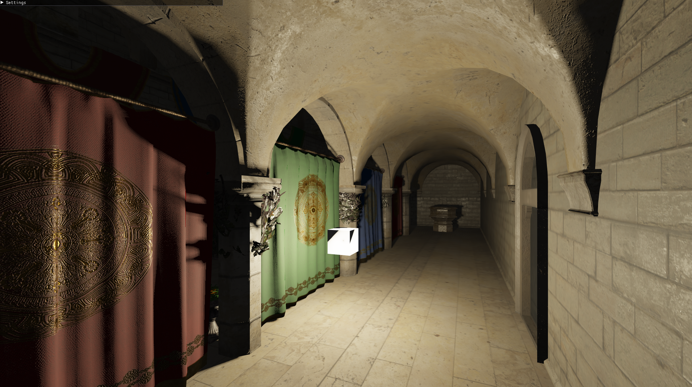

# Vulkan Rendering Engine

Vulkan engine capable of rendering 3-D scenes in real time.

Currently Supports:
- Rendering 3D GLTF Models.
- Physically Based Rendering
- Multisample anti-aliasing
- Omnidirectional Shadow Maps
- HDR Skyboxes
- Particle Systems (In Progress)

